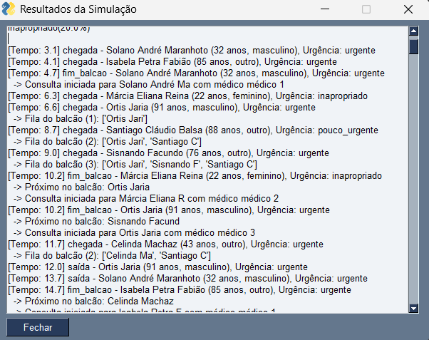
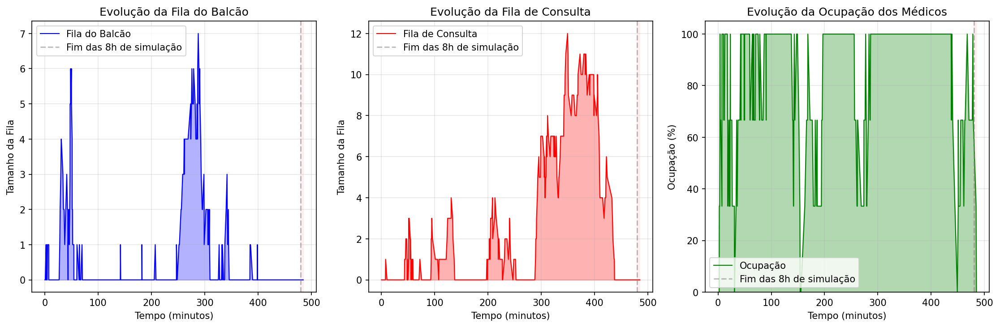
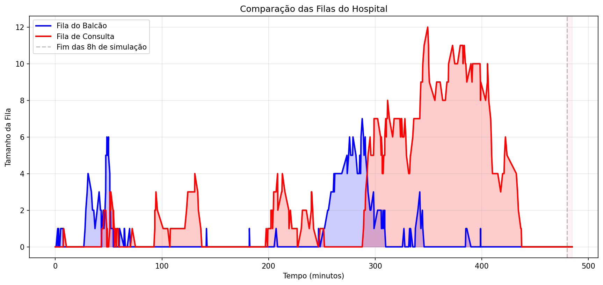
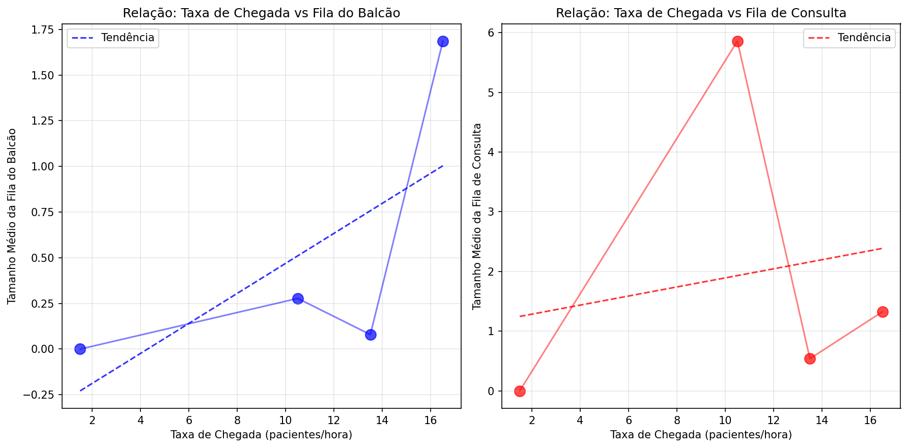

# Projeto simulação hospitalar 

- Na inicialização do programa projeto_sim_hospital.py, surge um painel de configuração da simulação hospitalar, no qual se podem editar vários parâmetros que influenciam os resultados obtidos.

- É possível variar as taxas de chegada de forma a aproximar a simulação de diferentes situações reais, em diversos contextos, sendo possível ajustar as taxas de chegada de pacientes das ondas definidas entre os valores de 10 e 30 pacientes por hora.

- É também permitido alterar o número de balcões (1–5 balcões), o tempo médio de atendimento (1–15 minutos) e o tipo de distribuição estatística utilizada para definir o tempo de atendimento (exponencial, normal ou uniforme).

- Da mesma forma, é possível editar parâmetros idênticos relativamente às consultas, sendo estes o número de médicos (1–5 médicos), o tempo médio das consultas (5–30 minutos) e o tipo de distribuição estatística utilizada para definir o tempo de consulta (exponencial, normal ou uniforme).

- Na parte inferior da interface encontra-se o botão para iniciar a simulação com os parâmetros definidos, um botão para restaurar os valores padrão recomendados e um botão para fechar a janela e o programa. É também apresentado o estado do programa em letras amarelas por baixo dos botões.

- Após o início da simulação, os resultados são apresentados numa nova janela que contém diversos dados estatísticos.

- No início da página são descritos os valores de cada parâmetro necessário para o funcionamento da simulação.

- De seguida, na mesma página, são documentados os eventos por ordem temporal. A cada paciente são atribuídos um nome, idade, sexo e tipo de urgência. É registado o tempo de chegada do paciente, o tempo de saída do balcão, o tempo de início da consulta e o tempo de saída da consulta. São ainda apresentados os nomes dos pacientes nas filas do balcão e das consultas, organizados em função do tempo de chegada e do tipo de urgência, bem como o tamanho respetivo de cada fila.

- Posteriormente à impressão dos eventos, são disponibilizados diferentes dados estatísticos.

- São também apresentados alguns gráficos contendo outros dados estatísticos:

- Gráficos que demonstram a evolução do tamanho da fila ao longo do tempo da simulação, tanto no balcão como na fila de espera das consultas e outro gráfico correspondente à evolução da percentagem de ocupação dos médicos ao longo do tempo.

- Gráfico de comparação das proporções entre os tamanhos das filas do balcão, sobrepondo os dados num único gráfico com a mesma escala.

- Gráficos que relacionam a evolução da taxa de chegada da simulação com o tamanho das filas do balcão e das consultas. É representada uma linha tracejada correspondente a uma regressão linear da relação entre as variáveis, de forma a tornar mais evidente a influência da taxa de chegada no tamanho das filas.

- Gráfico que apresenta a evolução da taxa de chegada ao longo do tempo.

- Em cada gráfico com a variável tempo no eixo horizontal x, é representada uma linha vertical tracejada e um posterior preenchimento a vermelho, indicando o fim das 8 horas de simulação de geração de chegadas estabelecidas e a consequente anulação da taxa de chegada. Esta representação permite identificar a capacidade de escoamento das filas e perceber quais os ajustes necessários para minimizar os tempos de espera e evitar a sobrecarga do sistema hospitalar.

- Resumidamente, o projeto foi idealizado para simular o funcionamento de um hospital de forma relativamente realista, proporcionando flexibilidade para representar diferentes situações hospitalares, com características distintas, e apresentando estatísticas úteis para a avaliação da influência de cada parâmetro no fluxo de pacientes.

## Exemplo de aplicação da simulação numa análise

- Suponhamos que pretendemos descobrir qual o número mínimo de médicos necessário para escoar as filas de forma eficiente, quando o tempo médio de consulta assume um determinado valor, evitando ao máximo o prolongamento do funcionamento após as 8 horas de simulação, mas mantendo simultaneamente uma elevada percentagem de ocupação e um tamanho médio da fila de espera o mais reduzido possível.

- Começamos por manter os valores padrão na maioria dos parâmetros, alterando apenas o tempo médio de consulta para o valor desejado, e fazemos variar o número de médicos.

- Iniciamos a simulação e observamos o gráfico da evolução do tamanho da fila de consultas e o gráfico da evolução da ocupação dos médicos.

- Por fim, analisamos os dados estatísticos finais no separador de resultados.

- Voltamos a alterar os parâmetros pretendidos e repetimos o processo.

### Exemplo de resultados para um tempo médio de consulta de 15 minutos:

- **2 médicos:**

  

- **3 médicos:**

  

- **4 médicos:**

  

- **5 médicos:**

  

- É possível observar, de forma geral, uma tendência progressiva para a diminuição do tempo de ocupação, do tamanho das filas e do tempo necessário após o fim da geração de chegadas. Verifica-se também um aumento acentuado do tempo após o fim da geração de chegadas quando o número de médicos é apenas 2, concluindo-se que o número mínimo de médicos aconselhável para evitar a sobrecarga do sistema hospitalar é 3.

- É importante realçar que a determinação dos tempos de chegada, de atendimento ao balcão e da duração das consultas é efetuada com base em distribuições estatísticas. Deste modo existe alguma variabilidade nos resultados entre simulações distintas com parâmetros idênticos, o que deve ser tido em conta na análise e avaliação dos resultados.